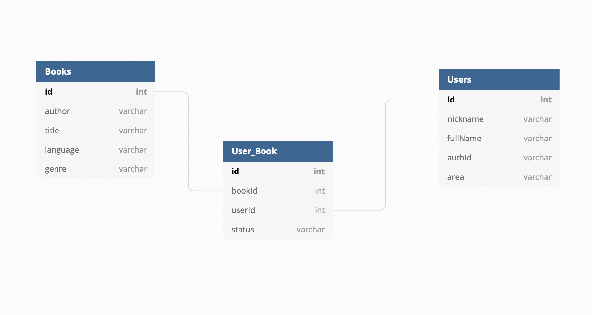

# Context
This application was created during a week-long spring at [Code Chrysalis](https://www.codechrysalis.io) 🦋.

The goal was to program a full-stack application by myself and to present the result to other students at the end of the week.

# The App Overview 📚
Book Club is an app which, in its final version, will enable users to :
* Manage their inventory of physical books 
* Search for other users in the area and browse their inventory 
* Contact other users to borrow some of their books 
* Manage the inventory lent out and send remainders to people who borrowed the books for too long 

# Features present in the MVP 👀
Due to timing constraints, the MVP has the following features:
* Authentication with Auth0
* React.js front-end which enables to add a book in the inventory
* Connection with GraphQL to the back-end
* Back-end server writing to the database
* Very basic chat engine for users to communicate with each other

# Deployment 💻
* The app is deployed with a free-tier program with **Heroku** at the following address: <https://bookclub-mvp.herokuapp.com>

# Tech used 🖥️
* The app is using [React.js](www.reactjs.org) for the front-end
* The app uses [GraphQL](https://graphql.org/) for the API communication between front-end and back-end
* The back-end server uses [Apollo Server](https://www.apollographql.com/docs/apollo-server/) for **GraphQL** API communication
* The back-end server communicates with the DB with [Knex.js](http://knexjs.org) and [Objection.js](https://vincit.github.io/objection.js/) as an ORM
* The database runs on [PostgreSQL](https://www.postgresql.org)
* The MVP was deployed on [Heroku](www.heroku.com) with their free tier (💸)
* Authentication services uses [auth0](https://auth0.com)
* The chat feature uses the free tier of [ChatEngine.io](https://www.chatengine.io) (**NOT DEPLOYED YET**)

# Future features 🤔
Tech suite:
  * Beefing up the **unit tests** for the server
  * Changing the chat from Chatengine.io to a real-time chat engine with **Firebase**
User features: 
  * Allowing users to input their books
  * Allowing users to search books of other users
  * Managing the status of books (e.g. lent out, returned, out of order, lost, etc)
  * 5-Star Ranking of borrowers (to prevent as much as possible people never giving books back)
  * "Safe places" to give a list of partner shops and cafes where people can drop and pick-up books.
  * Auto-complete for author names, titles

# Database schema ⚙️
Due to time constraints, the database schema is pretty simple.



# Installation 
If you just want to install the app locally, you can clone the github repository with the command below. (Note that if you want to make some modifications or tinker with the code, you will need to *fork the repo* before cloning your forked version).

To clone the repository:
```
git clone https://github.com/AlixFachin/BookClub.git
```
Then you will need to run the following command to get the dependencies installed on your local machine
```
npm run install
```
You then need to install `PostgreSQL` and create a database.
Once the database is created, you need to create a `.env` file in the project root file, similar to the `example.env` file provided.

Once the database is created, you need to prepare it for the app, i.e. creating all the tables and putting some initial data.
This is done with an `npm` command with the two following commands:
```
npm run migrate
npm run seed
```


You will need to create your own `Auth0` app to allow authentication to your local server.

In order to start the back-end server locally, you need to run 
```
npm run hack-server 
``` 
You will then need to open another terminal window and run the following command for the server to be running
```
npm run hack-client
```

# Useful links
Chat
* <https://flexiple.com/blog/build-a-powerful-chat-application-using-react-hooks/>
* <https://dev.to/bravemaster619/how-to-use-socket-io-client-correctly-in-react-app-o65>
Auth
* <https://auth0.com/blog/complete-guide-to-react-user-authentication/>
React setup
* <https://medium.com/@maison.moa/setting-up-an-express-backend-server-for-create-react-app-bc7620b20a61>
* <https://create-react-app.dev/docs/proxying-api-requests-in-development>
DB
* <http://knexjs.org/#Schema-string>
Deploy
* <https://medium.com/@chloechong.us/how-to-deploy-a-create-react-app-with-an-express-backend-to-heroku-32decfee6d18>

# How to contribute
Please submit a pull request with comments regarding the new feature.

# License
This product is licensed under the MIT License. Please have a look at the [licensing file](LICENSE.md) for more information.
